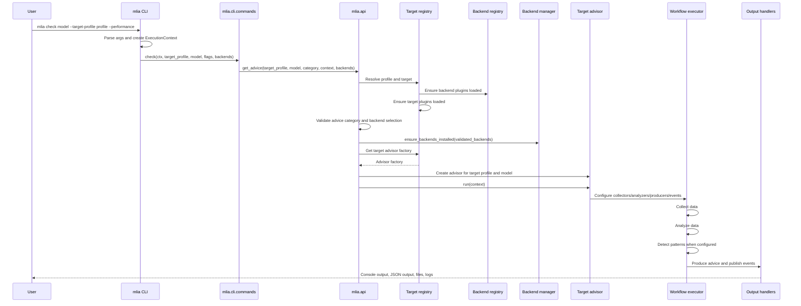

<!---
SPDX-FileCopyrightText: Copyright 2026, Arm Limited and/or its affiliates.
SPDX-License-Identifier: Apache-2.0
--->

# End-to-end Execution Flow

This page follows a typical `mlia check` run from the command line to final
reports. Plugin-specific collectors, analyzers, converters, and backend tools may
vary, but the core orchestration path is shared.

Use this page for runtime ordering and failure handling. For the static module
layout, see [High-level Architecture](high_level_architecture.md). For plugin
discovery and extension points, see [Plugin Architecture](plugin_architecture.md).

## Command flow



## Runtime responsibilities

| Step | Core owner | What happens |
| --- | --- | --- |
| Parse command | `mlia.cli.main` | Builds an argument parser from core and CLI plugin commands. |
| Build context | `mlia.cli.main.setup_context()` | Creates `ExecutionContext`, resolves output format, output directory, action resolver, and logging. |
| Select advice category | `mlia.cli.commands.check()` | Converts `--compatibility` and `--performance` flags into an advice-category set. |
| Validate target/profile | `mlia.cli.command_validators`, `mlia.target.registry` | Confirms the selected target profile supports the requested category. |
| Validate backends | `mlia.api.get_advice()` | Resolves requested backends against the target and supported backend registry. |
| Ensure backend installation | `mlia.backend.manager` | Checks or installs backends as required, subject to EULA and noninteractive settings. |
| Create advisor | `mlia.api.get_advisor()` | Finds the target from the profile and calls the target's advisor factory. |
| Run workflow | `mlia.core.advisor`, `mlia.core.workflow` | Executes collectors, analyzers, optional pattern analyzers, and advice producers. |
| Produce output | `mlia.core.reporting`, event handlers, output schema helpers | Emits console output, logs, generated files, and JSON-compatible data when requested. |

## Conceptual data flow

```mermaid
graph LR
    model[Input model] --> command[mlia check]
    profile[Target profile TOML] --> command
    backendOptions[Backend options] --> command

    command --> context[ExecutionContext]
    context --> outputDir[Output directory]
    context --> logs[logs/mlia.log]

    model --> collectors[Data collectors]
    profile --> advisor[Target advisor]
    advisor --> collectors
    collectors --> maybeConvert{Converter needed?}
    maybeConvert -->|yes| converter[Converter plugin]
    converter --> intermediate[Converted/intermediate artifact]
    maybeConvert -->|no| backendInput[Backend input artifact]
    intermediate --> backendInput
    backendInput --> backend[Backend tool or service]
    backend --> rawResults[Raw backend output]
    rawResults --> analyzers[Data analyzers]
    analyzers --> facts[Analyzed facts]
    facts --> producers[Advice producers]
    producers --> advice[Advice]
    advice --> events[Events]
    events --> handlers[Event handlers and reporters]
    handlers --> reports[Reports and JSON output]
    reports --> outputDir
```



The exact collector inputs, converted artifact names, backend outputs, and
analyzer facts are plugin-owned. The core guarantees the shared execution
context, workflow stages, event publishing, and output/reporting mechanisms.

## Failure flow

MLIA failures normally terminate the command and return a non-zero exit status.
The CLI always reports the run output directory at the end of command execution.
Unless `--output-dir` is set, logs and generated artifacts are written under
`mlia-output` in the current working directory. The main log file is
`mlia-output/logs/mlia.log`.

In normal CLI output, handled errors are intentionally short:

```text
Execution finished with error: <message>
Please check the log files in the mlia-output/logs for more details, or enable debug mode (--debug)
This execution of MLIA used output directory: mlia-output
```

With `--debug`, MLIA prints debug logging to the console and records debug logs
in `mlia-output/logs/mlia.log`. For unexpected exceptions, `--debug` also shows
the Python traceback. Handled error categories, such as configuration errors,
backend availability errors, and interrupted execution, are still displayed as
concise messages.

The CLI handles these categories specially:

| Failure category | User-visible behavior |
| --- | --- |
| Configuration error | Prints the configuration error message directly. |
| Backend unavailable | Prints `Error: Backend <name> is not available.` Some optional backends also include an installation hint, for example `mlia-backend install "<name>"`. |
| Interrupted execution | Prints `Execution has been interrupted`. |
| Internal error | Prints `Internal error: <message>`. |
| Other exception | Prints `Execution finished with error: <message>`, points to the log directory, and shows a traceback when `--debug` is enabled. |

Inside the workflow, exceptions from collection, analysis, pattern detection, or
advice production are first published as an `ExecutionFailedEvent`. That event
contains the original exception in its `err` field so event handlers can observe
or transform the failure. The default workflow event handler re-raises that
exception, so the CLI error handling described above still decides what the user
sees.

## API flow

Python callers can use `mlia.api` directly instead of invoking the CLI. The API
path still validates target profiles, backend selection, backend installation,
and advisor creation. `run_advisor()` additionally supports returning a
standardized JSON-compatible dictionary and optional schema validation modes.

Use the CLI when you want the standard command-line user experience. Use the API
when another Python tool needs to run MLIA and consume structured results.
