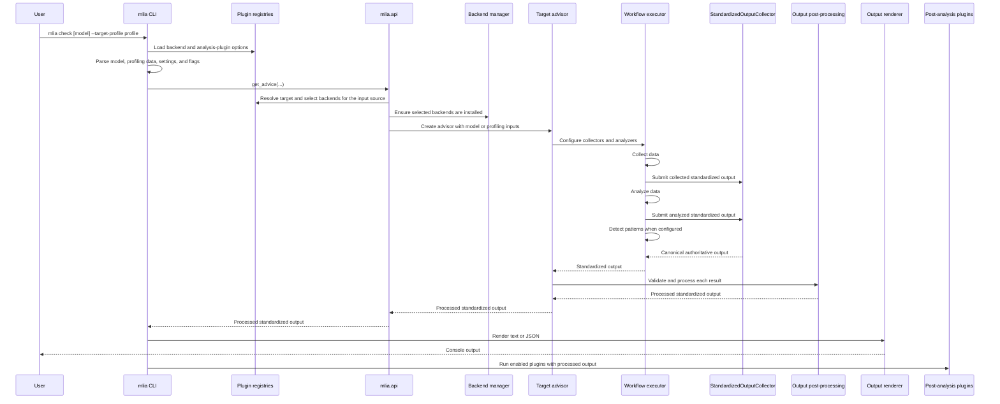

<!---
SPDX-FileCopyrightText: Copyright 2026, Arm Limited and/or its affiliates.
SPDX-License-Identifier: Apache-2.0
--->

# End-to-end Execution Flow

This page follows a typical `mlia check` run from command parsing to processed
standardized output. Plugin-specific collectors, analyzers, transformations, and
backend tools vary, but the core orchestration and output path is shared.

Use this page for runtime ordering and failure handling. For the static module
layout, see [High-level Architecture](high_level_architecture.md). For extension
points, see [Plugin Architecture](plugin_architecture.md).

## Command flow

```mermaid
sequenceDiagram
    participant User
    participant CLI as mlia CLI
    participant Plugins as Plugin registries
    participant API as mlia.api
    participant BackendMgr as Backend manager
    participant Advisor as Target advisor
    participant Workflow as Workflow executor
    participant Collector as StandardizedOutputCollector
    participant Post as Output post-processing
    participant Render as Output renderer
    participant Analysis as Post-analysis plugins

    User->>CLI: mlia check [model] --target-profile profile
    CLI->>Plugins: Load backend and analysis-plugin options
    CLI->>CLI: Parse model, profiling data, settings, and flags
    CLI->>API: get_advice(...)
    API->>Plugins: Resolve target and select backends for the input source
    API->>BackendMgr: Ensure selected backends are installed
    API->>Advisor: Create advisor with model or profiling inputs
    Advisor->>Workflow: Configure collectors and analyzers
    Workflow->>Workflow: Collect data
    Workflow->>Collector: Submit collected standardized output
    Workflow->>Workflow: Analyze data
    Workflow->>Collector: Submit analyzed standardized output
    Workflow->>Workflow: Detect patterns when configured
    Collector-->>Workflow: Canonical authoritative output
    Workflow-->>Advisor: Standardized output
    Advisor->>Post: Validate and process each result
    Post-->>Advisor: Processed standardized output
    Advisor-->>API: Processed standardized output
    API-->>CLI: Processed standardized output
    CLI->>Render: Render text or JSON
    Render-->>User: Console output
    CLI->>Analysis: Run enabled plugins with processed output
```

## Input and backend selection

A check needs at least one analysis source:

- a model path or supported in-memory model; or
- one or more profiling-data paths.

Profiling-data paths retain their supplied order and may identify files or
directories. The selected backend defines their accepted contents. Supplying
profiling data switches backend selection to profiling mode. Without an explicit
backend, MLIA first considers profiling-capable target defaults and falls back to
all profiling-capable target backends only when no capable default exists. The
resulting candidate set must contain exactly one backend. Model-only runs use the
target's default backends or explicitly selected backends; current selection
does not filter them by `supports_estimation`.

## Workflow output

Collectors and analyzers may expose complete standardized output on their data
items. `StandardizedOutputCollector` gathers collector outputs during data
collection and analyzer outputs during analysis. Pattern detection runs after
these submissions; facts produced by pattern analyzers are not submitted to the
standardized-output collector. If several outputs are produced, core merges
their result and backend lists and retains the first available shared metadata
such as model, target, context, schema version, run ID, timestamp, tool, and
extensions.

The workflow returns this canonical dictionary directly. It no longer relies on
target-specific event handlers to reconstruct output after execution.

## Core post-processing

`InferenceAdvisor.run()` applies the following stages to every standardized
result containing entities:

1. Validate the basic output structure and entity graph.
2. Collapse entities selected by backend defaults and application
   `filtering.collapse` rules.
3. Derive `code_line` entities from retained `code_stack` entities.
4. Project missing breakdowns conservatively across the normalized entity DAG.
5. Validate the processed standardized output again.

Breakdowns retained after entity collapse remain authoritative during projection;
collapse may discard breakdowns that target collapsed entities. Post-processing
returns a new output structure when changes are required rather than mutating
producer-owned input.
See [Outputs](metrics.md) for entity and projection semantics.

## Presentation and post-analysis

The CLI renders the processed dictionary using the target-agnostic text or JSON
renderer. Output that the active terminal encoding cannot represent is replaced
safely rather than changing the process-wide output encoding.

After rendering, enabled analysis plugins receive the same processed output,
the execution context, command arguments and parameters, output directory, and
their plugin-scoped settings. A plugin failure is reported as a command error;
plugins do not modify the core workflow that produced the canonical result.

Python callers using `run_advisor()` receive the processed dictionary directly.
API mode does not render reports to stdout or stderr.

## Failure flow

Exceptions from collection, analysis, pattern detection, output collection, or
post-processing propagate through the advisor and API to the CLI. The removed
workflow-event layer is not involved in failure delivery.

Handled configuration and backend-selection errors are shown concisely. Other
exceptions propagate to the CLI, and unexpected exceptions include a traceback
when `--debug` is enabled. Only messages explicitly emitted through logging are
guaranteed to appear in the run log. Logging handlers configured for one command
or API invocation are closed at the end of that run so repeated in-process
executions do not retain stale file or console handlers.

Unless `--output-dir` is set, generated files and logs use `mlia-output` beneath
the current working directory. The main log is
`mlia-output/logs/mlia.log`.

## API flow

`run_advisor()` mirrors target and backend selection, advisor execution, and
post-processing without invoking the CLI renderer or post-analysis plugins. It
supports model-based estimation and profiling-data input, optionally writes
artifacts, and returns a JSON-compatible standardized-output dictionary.

Core basic and entity-graph validation always runs. The API's validation mode
controls the additional JSON Schema validation performed before returning the
result.
