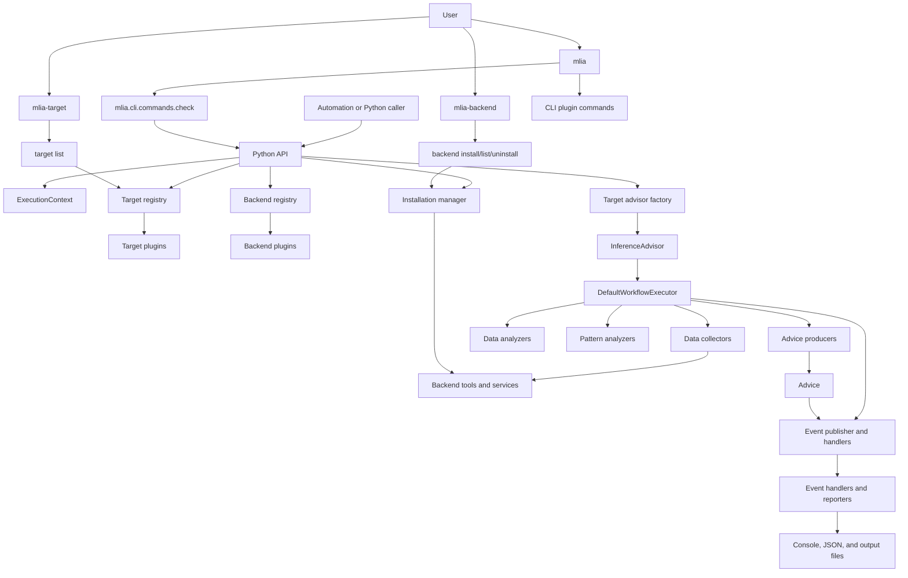

<!---
SPDX-FileCopyrightText: Copyright 2026, Arm Limited and/or its affiliates.
SPDX-License-Identifier: Apache-2.0
--->

# High-level Architecture

MLIA is a Python application and library built around one core package and
installable plugins. The core package owns the shared user experience and
runtime contracts; plugins add target, backend, converter, or CLI functionality
through Python entry points.

Use this page for the static system shape. For plugin loading details, see
[Plugin Architecture](plugin_architecture.md). For the step-by-step
`mlia check` path, see [End-to-end Execution Flow](execution_flow.md).

## System view

## Main runtime layers

| Layer | Core modules | Responsibility |
| --- | --- | --- |
| CLI | `mlia.cli.main`, `mlia.cli.commands`, `mlia.cli.options` | Parse `mlia`, `mlia-backend`, and `mlia-target` commands, create `ExecutionContext`, configure logging and output format, and call command functions. |
| Public API | `mlia.api` | Validate inputs, resolve targets and backends, ensure required backends are installed, create advisors, optionally return standardized output. |
| Registries | `mlia.target.registry`, `mlia.backend.registry`, `mlia.plugins.*` | Load plugin entry points once and expose registered target, backend, converter, and CLI capabilities. |
| Backend management | `mlia.backend.manager`, `mlia.backend.install`, `mlia.backend.config` | Show backend status, install/uninstall backends, resolve dependencies, and provide backend configuration metadata. |
| Execution context | `mlia.core.context` | Carry advice category, config parameters, output directory, action resolver, event publisher, handlers, and output format. |
| Advisor/workflow | `mlia.core.advisor`, `mlia.core.workflow` | Build and run the target-specific workflow stages. |
| Reporting/output | `mlia.core.reporting`, `mlia.core.reporters`, `mlia.core.output_schema`, `mlia.core.output_validation` | Produce human-readable and JSON-compatible results and validate standardized output. |

## Ownership boundaries

The core package should not need target-specific conditionals for every new
hardware family or converter. Instead:

- target plugins register target metadata and advisor factories
- backend plugins register backend configuration and installation metadata
- converter plugins register named converter callables
- CLI plugins can append commands to the command list

This keeps core orchestration stable while allowing target, backend, and
converter packages to evolve independently.
