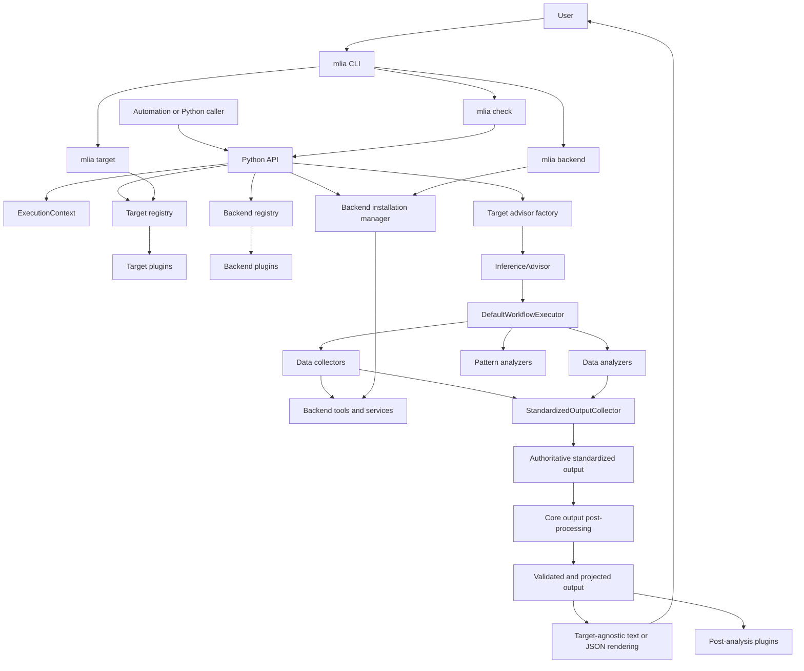

<!---
SPDX-FileCopyrightText: Copyright 2026, Arm Limited and/or its affiliates.
SPDX-License-Identifier: Apache-2.0
--->

# High-level Architecture

MLIA is a Python application and library built around one core package and
installable plugins. The core package owns the shared command-line experience,
workflow contracts, standardized output, and backend management. Plugins add
target, backend, transformer, or post-analysis functionality through Python
entry points.

Use this page for the static system shape. For plugin loading details, see
[Plugin Architecture](plugin_architecture.md). For the step-by-step
`mlia check` path, see [End-to-end Execution Flow](execution_flow.md).

## System view

```mermaid
graph TD
    user[User] --> mainCli[mlia CLI]
    automation[Automation or Python caller] --> api[Python API]

    mainCli --> checkCommand[mlia check]
    mainCli --> backendCommands[mlia backend]
    mainCli --> targetCommands[mlia target]
    checkCommand --> api

    api --> context[ExecutionContext]
    api --> targetRegistry[Target registry]
    api --> backendRegistry[Backend registry]
    api --> backendManager[Backend installation manager]
    api --> advisorFactory[Target advisor factory]

    targetRegistry --> targetPlugins[Target plugins]
    backendRegistry --> backendPlugins[Backend plugins]
    advisorFactory --> advisor[InferenceAdvisor]

    advisor --> workflow[DefaultWorkflowExecutor]
    workflow --> collectors[Data collectors]
    workflow --> analyzers[Data analyzers]
    workflow --> patterns[Pattern analyzers]
    collectors --> backends[Backend tools and services]
    backendManager --> backends

    collectors --> outputCollector[StandardizedOutputCollector]
    analyzers --> outputCollector
    outputCollector --> authoritative[Authoritative standardized output]
    authoritative --> postprocess[Core output post-processing]
    postprocess --> processed[Validated and projected output]

    processed --> renderer[Target-agnostic text or JSON rendering]
    renderer --> user
    processed --> analysisPlugins[Post-analysis plugins]

    backendCommands --> backendManager
    targetCommands --> targetRegistry
```

The standardized output returned by the workflow is authoritative. Core
post-processing validates it, applies configured entity collapse, derives
source-line entities, projects missing breakdowns across the entity graph, and
validates the result again. Rendering and post-analysis plugins consume that
processed output; they do not reconstruct it from workflow events.

## Main runtime layers

| Layer | Core modules | Responsibility |
| --- | --- | --- |
| CLI | `mlia.cli.main`, `mlia.cli.commands`, `mlia.cli.command_validators` | Parse commands, add dynamic backend and analysis-plugin options, build execution context, render output, and invoke enabled post-analysis plugins. |
| Public API | `mlia.api` | Validate model or profiling inputs, resolve targets, select backends for the input source, ensure required backends are installed, run advisors, and return standardized output. |
| Registries | `mlia.target.registry`, `mlia.backend.registry`, `mlia.plugins.*` | Load plugin entry points and expose registered target, backend, transformer, and analysis capabilities. |
| Backend management | `mlia.backend.manager`, `mlia.backend.install`, `mlia.backend.config` | Report backend status, install or remove backends, resolve dependencies, and describe estimation and profiling capabilities. |
| Execution context | `mlia.core.context` | Carry advice category, parameters, output directory, action resolution, and output format through a run. |
| Advisor and workflow | `mlia.core.advisor`, `mlia.core.workflow`, `mlia.core.output_collection` | Configure collectors and analyzers, execute workflow stages, and collect their canonical standardized output. |
| Output post-processing | `mlia.core.output_postprocessing`, `mlia.core.entity_graph`, `mlia.core.entity_collapse`, `mlia.core.code_line`, `mlia.core.output_projection`, `mlia.core.output_validation` | Validate entity graphs, collapse selected entities, derive code-line views, project breakdowns, and enforce the standardized output contract. |
| Presentation | `mlia.core.output_rendering`, `mlia.core.reporting` | Render processed standardized output as target-agnostic text or JSON. |
| Post-analysis extensions | `mlia.plugins.analysis` | Add optional `mlia check` options and consume the completed output with command-scoped context and plugin-scoped settings. |

## Ownership boundaries

The core package should not need target-specific conditionals for every new
hardware family, backend, converter, or downstream analysis. Instead:

- Target plugins register target metadata and advisor factories.
- Backend plugins register capabilities, configuration, installation metadata,
  CLI options, and optional default entity-collapse rules.
- Transformer plugins register named model transformation callables.
- Analysis plugins can add check options and process completed standardized
  output after a successful run.

The generic plugin utilities retain an `mlia.plugin.cli` loader, but the Typer
application does not call it. The top-level command tree is therefore core-owned
and cannot currently be extended through CLI entry points.

This keeps orchestration, validation, and output contracts in core while
allowing plugin packages to evolve independently.
